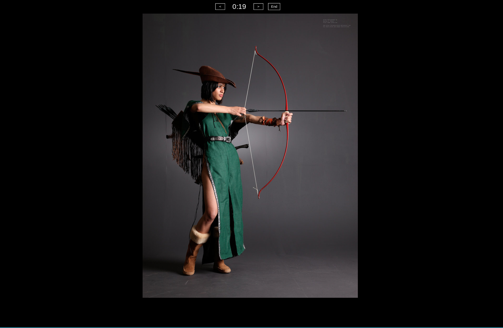

# Tweede

## An image slideshow for drawing.

Creator: Pascal Bakker

Tweede [(1)](https://forvo.com/word/tweede/#nl) is a lightweight desktop application for artists to warm up. Execute tweede from your reference folder and it will rotate through every image at given time interval.

Similar websites for context:

http://reference.sketchdaily.net/

https://quickposes.com/en

https://line-of-action.com/

# TODO

	Add pause button

	Add class mode where users can set a time sequence. (I.e 5 images 30 seconds, 2 images 60 seconds, 1 image 500 seconds.)

	Add a gui start screen. Users will still be able to use the command line, but this streamlines the process for Windows users.
